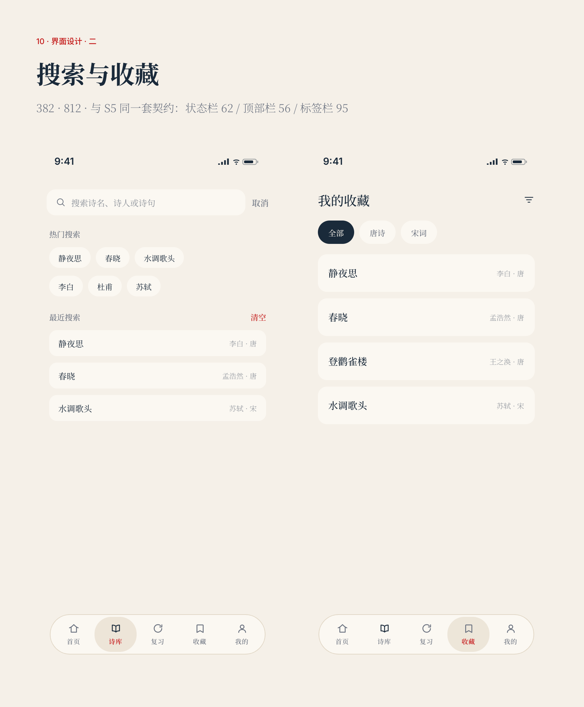

# 诗词雅集 · shici_yaji

一款**离线优先**的古诗词学习与欣赏应用，支持桌面（Windows / macOS / Linux）与移动（Android / iOS）端。
所有诗词数据随包内置，无需联网即可浏览、学习、做笔记与打卡。

> 当前定位：个人使用为主，优先功能完整度与自有的「雅集」视觉风格（黛蓝 / 朱砂 / 宣纸白配色体系，变量集见 `lib/core/design_tokens.dart`）。

---

## 界面预览


<p align="center">
  
</p>

---

## 关于内容质量（重要）

全库 **1320 首**（预置 70 + 扩充 1250）的**赏析与创作背景**均已逐首校订为真实内容；
**小学包 150 首译文 100% 齐备**（手写 + 古诗词网/百度汉语外源）。

2026 修复发现：此前部分唐诗/宋词的「译文」其实是**原文照抄或截取**（并非白话翻译）。
处理原则是**宁缺毋错**：
- 有免费站点覆盖的篇目，换成真实白话译文（来源 `www.gushici.net`、`hanyu.baidu.com`）；
- 无外源覆盖的冷门篇目，**清空译文**（详情页不再展示错误内容，可本地补写）。

当前译文覆盖约 **73%**（970/1320 精校，0 条假译文/伪译，350 首暂缺）；
小学包 150 首译文 100%。赏析/背景仍为 100% 精校。
剩余暂缺集中在冷门应制诗与全集长尾——免费公开站点普遍没有白话译文，
应用中显示为「暂无译文」，可点「我来写」本地补全。

早期扩充包曾用脚本批量生成过「完整但偏说明性」的译文/赏析/背景（生成脚本见 `tools/auto_fill_content.py`），
这些文本已替换或清空。应用保留了「内容可信度」机制以便长期把关：详情页的每个内容区块
带可信度徽标（精校 / 说明性补充 / 暂缺），分级由 `tools/audit_content_quality.py` 离线算出并写入
`assets/data/content_quality.json`；数据变动后跑一次 `--check` 即可发现漂移。
严格坏译文扫描见 `tools/detect_bad_translations.py`。

你也可以在详情页点「我来写」补上自己的理解 —— 它存在 `poem_content_overrides` 表里，
与可再生的诗词数据隔离，升级离线包不会覆盖，备份也会带走。

---

## 功能特性

- **每日一诗**：每天自动推送一首诗词，并可回溯历史。
- **诗词库**：按朝代、体裁、主题多维筛选；支持列表 / 网格两种浏览方式。
- **全文检索**：标题、作者、正文关键词搜索（含拼音全拼与首字母）。
- **阅读模式**：通读 / 对照（逐联配译文）/ **竖排**（古籍式自右向左，轻点查字）。
- **收藏与收藏夹**：可创建多个收藏夹，对收藏诗词分组管理。
- **学习计划**：内置「唐诗三百首 / 宋词精选 / 小学必背」以及**节气节日与题材专题**、
  **教材同步单元**（小学第 1–4 单元、必背写景/抒情等）。也支持自建计划、
  向计划追加诗词并查看真实学习进度；**可设每日定量**，首页据此给出「今日任务 · 今天这几首」。
  计划卡可 **连续听**（听诗连播）。
- **学习打卡**：标记已学、艾宾浩斯复习提醒、连续打卡天数、学习热力图。
- **内容可信度标注**：译文/赏析/背景按「精校 / 说明性补充」如实标注，并支持本地补写（见上节）。
- **逐句跟读**：正文按句读断句逐句朗读，当前句高亮、可点任一句重听、支持单句循环。
- **客观题自测**：由本地数据现出「补全诗句 / 接下句 / 猜作者」三种题，机器判卷，
  结果与复习调度同源；错题可直接跳回全诗。
- **学习月报**：按自然月汇总学过的篇目、打卡天数、最长连续、代表诗句，可导出长图分享。
- **笔记**：为每首诗词添加、编辑、删除学习笔记。
- **离线诗词包**：通过 `assets/data/packs/*.json` 导入扩展诗词（唐诗 600 / 宋词 500 / 小学 150）。
- **朗读**：基于 TTS 的诗词朗读（需要设备支持）；**听诗连播**：计划/收藏/详情可发起多首连续听，
  主壳底部迷你条可暂停/上下篇/结束，切页后仍可继续；月报统计听读篇次。
- **听写默写**：详情页长按正文进入「听写默写」，听音补空、对照原文字。
- **相关篇目**：详情页底部同作者/同题横向卡片，便于对比阅读。
- **作者年表**：诗人页按库内编次排列作品时间线。
- **飞花令段位**：按历史最佳分晋升（童生→状元），结算页显示本局段位。
- **名句日签**：首页今日推荐卡展示名句，一键「导出日签」分享图。
- **主题与统计**：明/暗主题切换、全局字号四档；学习总览、朝代 / 作者分布等统计图表。
- **数据备份 / 恢复**：一键导出全部用户数据（收藏 / 收藏夹 / 学习计划 / 打卡 / 笔记 /
  阅读历史 / 离线包 / 本地补写内容）为 JSON 并分享转存；支持从备份文件合并恢复，不覆盖现有数据。

---

## 技术架构

| 层面 | 方案 |
| --- | --- |
| 框架 | Flutter 3.24+（stable） |
| 数据库 | `sqflite`（移动）/ `sqflite_common_ffi`（桌面），单例封装于 `DatabaseHelper` |
| 状态 | 轻量 `StatefulWidget` + `setState`，按页面局部刷新 |
| UI 组件 | `shadcn_ui` 风格组件 + 自研主题 `AppTheme` |
| 本地存储 | `shared_preferences`（主题、偏好等） |
| 语音 | `flutter_tts` |

主要目录：

```
lib/
  main.dart                 # 启动入口、主题、底部导航壳
  core/theme.dart           # AppTheme 配色与主题
  data/
    database/database_helper.dart   # 全部数据访问（DAO）
    models/models.dart              # Poem / Author / Dynasty / Category / StudyPlan / StudyNote ...
  presentation/
    pages/                 # 各业务页面
    widgets/               # 复用组件（热力图、卡片等）
  utils/
assets/
  data/poems.json           # 预置诗词库
  data/packs/               # 可导入的离线诗词包
test/                       # 单元测试与集成测试（sqflite_ffi 驱动）
```

---

## 环境要求

- Flutter SDK 3.24 及以上（stable）
- 桌面端需对应平台的原生构建工具；Android 需 Android SDK
- 网络仅在首次 `flutter pub get` 时需要；运行与学习过程完全离线

---

## 构建与运行

```bash
# 1. 安装依赖
flutter pub get

# 2. 运行（桌面 / 模拟器）
flutter run

# 3. 构建发布包
flutter build apk          # Android
flutter build windows      # Windows
flutter build macos        # macOS

# 4. 运行测试
flutter test
```

数据库在首次启动时由 `DatabaseHelper.preInit()` 初始化：加载预置诗词、建立索引、
执行版本迁移，并生成预设计划。初始化失败不会阻塞应用启动（仅记录日志）。

---

## 数据说明

- **预置数据**：`assets/data/poems.json` 包含朝代、作者、分类与诗词正文。
- **内容分级**：`assets/data/content_quality.json` 由 `tools/audit_content_quality.py` 生成，
  记录哪些篇目的译文/赏析/背景是脚本生成的说明性补充（判据写在脚本里，可复现）。
  改完数据记得重跑；`--check` 模式会在不一致时以非零码退出。
- **分类体系**：`categories` 以 `type` 区分（如 学习 / 情感 / 题材），诗词库页面按真实 `type` 动态分组，新增类型无需改代码。
- **离线包**：将符合结构的 JSON 放入 `assets/data/packs/` 并重新构建即可扩展诗词量；包内诗词按幂等规则导入，重复安装不会插入重复行。可用 `python tools/expand_offline_packs.py` 从 chinese-poetry 源数据重建扩充包。
- **学习记录**：`study_records` 以 `(poem_id, study_date)` 唯一约束避免同日重复打卡产生脏数据；
  「背诵自测」与「客观题」写入同一张表（`自测通过` / `自测未过`），因此共享复习调度与统计。
- **用户补写**：`poem_content_overrides` 以 `(poem_id, field)` 为主键存放本地覆盖，
  **刻意独立于 `poems` 表** —— 后者是可再生数据，版本迁移会整块重建。

---

## 测试

`test/` 下覆盖数据库 DAO（收藏夹、笔记、复习、统计、成就）、离线包导入、集成流程等。
使用 `sqflite_common_ffi` 在本地文件系统上运行，无需真机：

```bash
flutter test
```

---

## 许可证

个人项目，仅供学习与交流使用。
